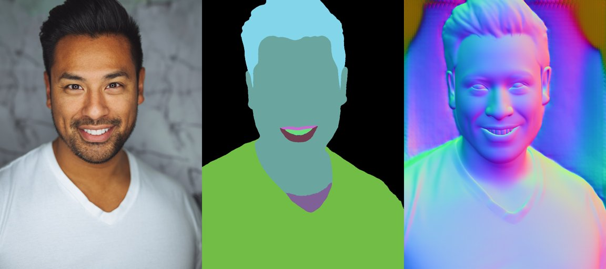

<div align="center">
  
  <h1>strands-sapiens</h1>
  <p><strong>Give your agent a body.</strong> Pixel-perfect human understanding, as Strands tools.</p>
  <p>
    <a href="https://pypi.org/project/strands-sapiens/"></a>
    <a href="https://pypi.org/project/strands-sapiens/"></a>
    <a href="https://github.com/cagataycali/strands-sapiens/actions"></a>
    <a href="https://cagataycali.github.io/strands-sapiens/"></a>
    <a href="https://github.com/cagataycali/strands-sapiens"></a>
    <a href="https://github.com/cagataycali/strands-sapiens/blob/main/LICENSE"></a>
  </p>
</div>

---

Wraps Meta's [Sapiens2](https://github.com/facebookresearch/sapiens2) - a family of high-resolution vision transformers pretrained on **1 billion human images** - as first-class [Strands Agents](https://github.com/strands-agents/sdk-python) tools.

<p align="center">
  
  <br>
  <em>Real output: Input → 29-class segmentation → surface normals (0.4b model, NVIDIA Thor)</em>
</p>

Every tool returns the standard Strands `ToolResult` format (`status` + `content` list with `text`, `json`, and inline `image` blocks), so the agent can **read structured data and see visual output** in a single call.

## Tools

| Tool | What it does | Model sizes |
|------|-------------|-------------|
| **`sapiens_seg`** | 29-class body-part segmentation | 0.4b · 0.8b · 1b · 5b |
| **`sapiens_normal`** | Per-pixel surface-normal estimation | 0.4b · 0.8b · 1b · 5b |
| **`sapiens_albedo`** | Intrinsic color (illumination-invariant) estimation | 0.4b · 0.8b · 1b · 5b |
| **`sapiens_pointmap`** | 3D pointmap - lifts each pixel to camera-space XYZ | 0.4b · 0.8b · 1b · 5b |
| **`sapiens_pose`** | 308-keypoint 2D pose (face + body + hands + feet) | 0.4b · 0.8b · 1b · 5b |
| **`sapiens_backbone`** | Raw pretrained backbone features | 0.1b · 0.4b · 0.8b · 1b · 1b_4k · 5b |
| **`sapiens_info`** | Inspect local checkpoints, CUDA status, env | - |
| **`sapiens_video`** | Frame-by-frame video processing (any dense task) | 0.4b · 0.8b · 1b · 5b |

## Install

```bash
pip install strands-sapiens
```

### Prerequisites

```bash
# 1. CUDA-enabled PyTorch (platform-specific)

[![Awesome Strands Agents](https://img.shields.io/badge/Awesome-Strands%20Agents-00FF77?style=flat-square&logo=data:image/svg+xml;base64,PHN2ZyB3aWR0aD0iMjkwIiBoZWlnaHQ9IjQ2MyIgdmlld0JveD0iMCAwIDI5MCA0NjMiIGZpbGw9Im5vbmUiIHhtbG5zPSJodHRwOi8vd3d3LnczLm9yZy8yMDAwL3N2ZyI+CjxwYXRoIGQ9Ik05Ny4yOTAyIDUyLjc4ODRDODUuMDY3NCA0OS4xNjY3IDcyLjIyMzQgNTYuMTM4OSA2OC42MDE3IDY4LjM2MTZDNjQuOTgwMSA4MC41ODQzIDcxLjk1MjQgOTMuNDI4MyA4NC4xNzQ5IDk3LjA1MDFMMjM1LjExNyAxMzkuNzc1QzI0NS4yMjMgMTQyLjc2OSAyNDYuMzU3IDE1Ni42MjggMjM2Ljg3NCAxNjEuMjI2TDMyLjU0NiAyNjAuMjkxQy0xNC45NDM5IDI4My4zMTYgLTkuMTYxMDcgMzUyLjc0IDQxLjQ4MzUgMzY3LjU5MUwxODkuNTUxIDQxMS4wMDlMMTkwLjEyNSA0MTEuMTY5QzIwMi4xODMgNDE0LjM3NiAyMTQuNjY1IDQwNy4zOTYgMjE4LjE5NiAzOTUuMzU1QzIyMS43ODQgMzgzLjEyMiAyMTQuNzc0IDM3MC4yOTYgMjAyLjU0MSAzNjYuNzA5TDU0LjQ3MzggMzIzLjI5MUM0NC4zNDQ3IDMyMC4zMjEgNDMuMTg3OSAzMDYuNDM2IDUyLjY4NTcgMzAxLjgzMUwyNTcuMDE0IDIwMi43NjZDMzA0LjQzMiAxNzkuNzc2IDI5OC43NTggMTEwLjQ4MyAyNDguMjMzIDk1LjUxMkw5Ny4yOTAyIDUyLjc4ODRaIiBmaWxsPSIjRkZGRkZGIi8+CjxwYXRoIGQ9Ik0yNTkuMTQ3IDAuOTgxODEyQzI3MS4zODkgLTIuNTc0OTggMjg0LjE5NyA0LjQ2NTcxIDI4Ny43NTQgMTYuNzA3NEMyOTEuMzExIDI4Ljk0OTIgMjg0LjI3IDQxLjc1NyAyNzIuMDI4IDQ1LjMxMzhMNzEuMTcyNyAxMDMuNjcxQzQwLjcxNDIgMTEyLjUyMSAzNy4xOTc2IDE1NC4yNjIgNjUuNzQ1OSAxNjguMDgzTDI0MS4zNDMgMjUzLjA5M0MzMDcuODcyIDI4NS4zMDIgMjk5Ljc5NCAzODIuNTQ2IDIyOC44NjIgNDAzLjMzNkwzMC40MDQxIDQ2MS41MDJDMTguMTcwNyA0NjUuMDg4IDUuMzQ3MDggNDU4LjA3OCAxLjc2MTUzIDQ0NS44NDRDLTEuODIzOSA0MzMuNjExIDUuMTg2MzcgNDIwLjc4NyAxNy40MTk3IDQxNy4yMDJMMjE1Ljg3OCAzNTkuMDM1QzI0Ni4yNzcgMzUwLjEyNSAyNDkuNzM5IDMwOC40NDkgMjIxLjIyNiAyOTQuNjQ1TDQ1LjYyOTcgMjA5LjYzNUMtMjAuOTgzNCAxNzcuMzg2IC0xMi43NzcyIDc5Ljk4OTMgNTguMjkyOCA1OS4zNDAyTDI1OS4xNDcgMC45ODE4MTJaIiBmaWxsPSIjRkZGRkZGIi8+Cjwvc3ZnPgo=&logoColor=white)](https://github.com/cagataycali/awesome-strands-agents)
pip install torch torchvision --index-url https://download.pytorch.org/whl/cu124

# 2. Sapiens2 from source
pip install git+https://github.com/facebookresearch/sapiens2.git

# 3. Download checkpoints (see upstream MODEL_ZOO)
#    Default location: ~/sapiens2_host (override with $SAPIENS_CHECKPOINT_ROOT)
```

<details>
<summary><strong>Expected checkpoint layout</strong></summary>

```
~/sapiens2_host/
├── pretrain/  sapiens2_{0.1b,0.4b,0.8b,1b,1b_4k,5b}_pretrain.safetensors
├── seg/       sapiens2_{0.4b,0.8b,1b,5b}_seg.safetensors
├── normal/    sapiens2_{0.4b,0.8b,1b,5b}_normal.safetensors
├── albedo/    sapiens2_{0.4b,0.8b,1b,5b}_albedo.safetensors
├── pointmap/  sapiens2_{0.4b,0.8b,1b,5b}_pointmap.safetensors
├── pose/      sapiens2_{0.4b,0.8b,1b,5b}_pose.safetensors
└── detector/  detr-resnet-101-dc5/              (DETR from HuggingFace)
```

Override with:
```bash
export SAPIENS_CHECKPOINT_ROOT=/data/sapiens2_host
```

</details>

## Quick start

### With a Strands agent

```python
from strands import Agent
from strands_sapiens import TOOLS

agent = Agent(tools=TOOLS)

# Natural language → the agent picks the right tool
agent("Segment every person in /data/photos and save to /data/out")
agent("Estimate surface normals for photo.jpg using the 1b model")
agent("What checkpoints do I have installed?")
```

### Cherry-pick individual tools

```python
from strands import Agent
from strands_sapiens import sapiens_seg, sapiens_pose

agent = Agent(tools=[sapiens_seg, sapiens_pose])
agent("Run pose estimation on /tmp/input/dancer.jpg, save to /tmp/out")
```

### Direct Python call (no agent)

Every tool is a regular Python function:

```python
from strands_sapiens import sapiens_seg

result = sapiens_seg(
    input_path="human.jpg",
    output_dir="./out",
    model_size="0.4b",
    save_pred=True,
)
print(result["status"])  # "success"
```

## Response format

All tools return the standard [Strands `ToolResult`](https://github.com/strands-agents/sdk-python) format:

```python
{
    "status": "success",          # or "error"
    "content": [
        {"text": "seg complete on 3 image(s)"},          # summary
        {"image": {"format": "jpeg", "source": {"bytes": b"..."}}},  # inline vis (up to 5)
        {"json": {                                        # structured data
            "task": "seg",
            "model_size": "0.4b",
            "outputs": [
                {"input": "/data/human.jpg", "vis": "/out/human.jpg", "pred": "/out/human_seg.npy"}
            ]
        }}
    ]
}
```

This means the agent can:
- **Read** the text summary
- **See** the visualization images inline (same format as `strands_tools.image_reader`)
- **Parse** the structured JSON for downstream tool chaining

On error, `content` contains a text message and optionally a `json` block with `traceback`.

## Verified environments

| Platform | PyTorch | Checkpoints tested |
|----------|---------|-------------------|
| NVIDIA Thor (JetPack 6, aarch64) | 2.7+ | 0.1b pretrain, 0.4b seg |
| Ubuntu 22.04 x86_64 | 2.4+ | 0.4b seg/normal/pose |

> Python ≥ 3.10 required. JetPack 6 ships 3.10 by default.

## Development

```bash
git clone https://github.com/cagataycali/strands-sapiens.git
cd strands-sapiens
pip install -e '.[dev]'
pytest -q
```

Smoke tests do **not** require CUDA, GPU, or checkpoints.

## Troubleshooting

| Error | Fix |
|-------|-----|
| `Missing checkpoint: ...` | Your `$SAPIENS_CHECKPOINT_ROOT` is missing the file. Run `sapiens_info()` to see what's present. |
| `No config found for task=...` | Installed `sapiens` version doesn't match expected config paths. The wrapper tries `rglob` as fallback - if that fails too, open an issue with `pip show sapiens` output. |
| `sapiens.pose high-level API not available` | Your sapiens2 build lacks `sapiens.pose.inference.Inferencer`. The error message shows how to run the upstream CLI script directly. |

## License

- **This wrapper**: [MIT](LICENSE)
- **Sapiens2 models & code**: [Sapiens2 License](https://github.com/facebookresearch/sapiens2/blob/main/LICENSE.md) (Meta)
