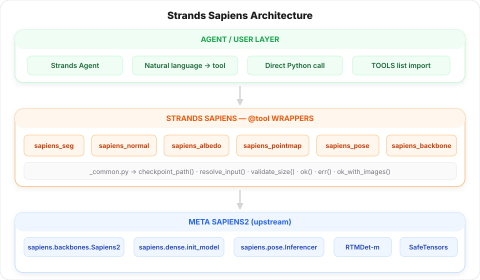

# Architecture

<figure markdown="span">
  { width="100%" loading="lazy" }
  <figcaption>High-level architecture: lazy imports, structured responses, compatibility fallbacks</figcaption>
</figure>

## How the package is organized

```
strands_sapiens/
├── __init__.py       # re-exports the 8 @tool functions + TOOLS list
├── _common.py        # checkpoint discovery, input resolution, response helpers
└── tools.py          # all @tool implementations
```

Everything heavy is imported **lazily** - a fresh `import strands_sapiens` does
not import `torch`, `sapiens`, or `cv2`. That keeps agent startup fast and
makes the smoke tests runnable on a CPU-only CI.

## Tool anatomy

Each tool follows the same shape:

```python
@tool
def sapiens_<task>(...) -> dict:
    """Docstring the agent sees."""
    try:
        size = validate_size("<task>", model_size)    # normalize + check
        ckpt = checkpoint_path("<task>", size)         # compute expected path
        if not ckpt.exists():
            return err(f"Missing checkpoint: {ckpt}")

        # lazy imports so the module is still importable without these deps
        import torch, cv2
        from sapiens.<...> import ...

        # inference, visualization, save results
        return ok("...", outputs=[...], checkpoint=str(ckpt))
    except Exception as e:
        return err(f"sapiens_<task> failed: {e}", traceback=traceback.format_exc())
```

Benefits:

- **Agent-safe failure mode**: a broken checkpoint never raises - it returns a structured error with a traceback, so an agent can inspect and recover.
- **Short import time**: a fresh Python shell imports the whole package in ~50ms.
- **Testable on CPU / CI** without any weights or GPU.

## Response contract

Every tool returns the standard Strands `ToolResult` format:

```python
{
    "status": "success",          # or "error"
    "content": [
        {"text": "seg complete on 3 image(s)"},          # summary
        {"image": {"format": "jpeg", "source": {"bytes": b"..."}}},  # inline vis (up to 5)
        {"json": {                                        # structured data
            "task": "seg",
            "model_size": "0.4b",
            "checkpoint": "...",
            "output_dir": "...",
            "outputs": [{"input": "...", "vis": "...", "pred": "..."}]
        }}
    ]
}
```

## Compatibility strategy

Sapiens2 is active research code - config paths and API surfaces move. The wrapper hedges against this with:

- **Arch-name helper** (`_common.arch_name`) - converts `0.1b → sapiens2_01b`, handles `1b_4k → sapiens2_1b`.
- **Config `rglob` fallback** - if `configs/seg/shutterstock_goliath/sapiens2_0.4b_seg-1024x768.py` is gone, `rglob("sapiens2_0.4b_seg*.py")` under `configs/seg/` still finds it.
- **Forward output polymorphism** - backbone outputs may be tensor / list / tuple / dict; the wrapper picks the final-stage feature map in all cases.
- **Forward signature fallback** - `model(inputs)` first, then `model(inputs, data_samples)`.
- **Multi-path pose API** - tries `Inferencer` → `init_pose_model + PoseVisualizer` → scripted fallback.
- **Visualizer kwargs filtering** - only forwards `kpt_thres` / `line_thickness` / `radius` if the installed `PoseVisualizer.__init__` signature actually accepts them.
- **Inline visualizers** for normals / albedo / pointmap - no dependency on upstream visualizer classes that come and go.

## Data flow (dense tasks)


## Data flow (pose)


## Why Strands?

- **`@tool` decorator** gives every function a schema the agent can reason over.
- **Dicts in, dicts out** - no ORM, no global state, no `context` object.
- **Composable** - cherry-pick one tool, or import the whole `TOOLS` list for a Sapiens-literate agent.

## Roadmap

- **True batching**: current loop is one-image-at-a-time. Adding batched inference will give a 3–5× speedup on dense tasks.
- **TensorRT**: for Jetson-class hardware, TRT conversion can cut latency in half.
- **Downstream heads**: `sapiens_body_part_attention(image, limb)` etc., built on seg + pointmap.
