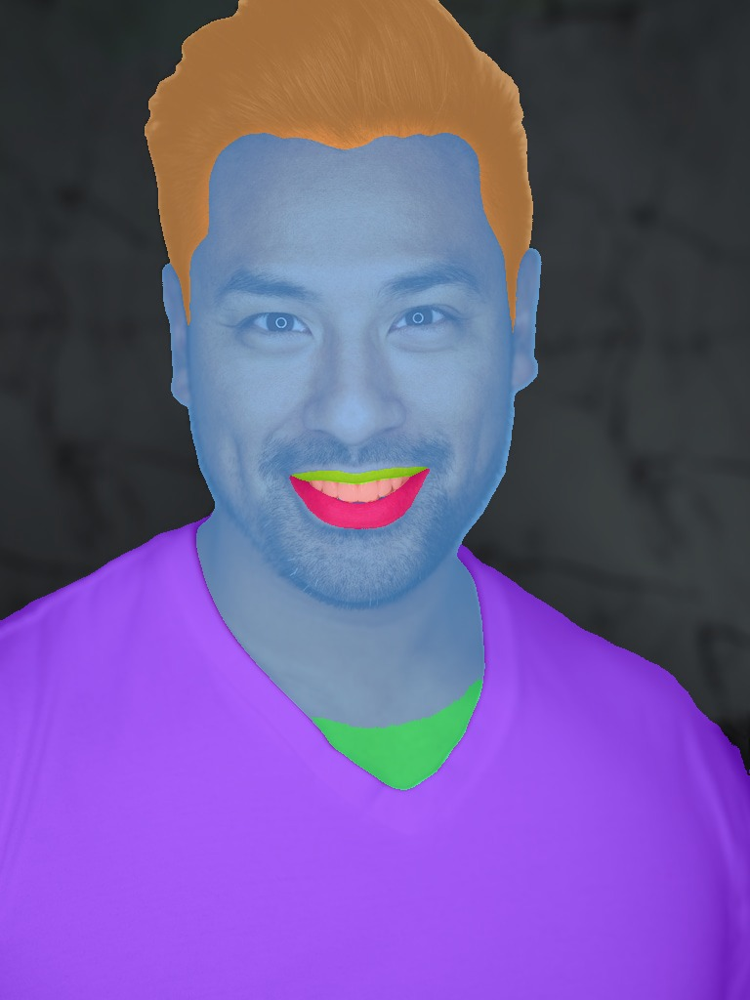

# Batch segmentation on a folder

Run body-part segmentation on every image in a folder, then summarize class coverage across the dataset.

<figure markdown="span">
  { width="560" loading="lazy" }
  <figcaption>Side-by-side output from a single image — imagine this for every file in a folder</figcaption>
</figure>

## Code

```python
from pathlib import Path
import numpy as np
from collections import Counter

from strands_sapiens import sapiens_seg

# 1. Run segmentation on the whole folder
result = sapiens_seg(
    input_path="./photos",
    output_dir="./out",
    model_size="0.4b",
    save_pred=True,
)
assert result["status"] == "success"

# 2. Extract structured outputs from the JSON content block
json_block = [b for b in result["content"] if "json" in b][0]["json"]

# 3. Load every _seg.npy and count class pixel frequencies
totals = Counter()
for entry in json_block["outputs"]:
    if "pred" not in entry:
        continue
    labels = np.load(entry["pred"])             # (H, W)
    for cls, count in zip(*np.unique(labels, return_counts=True)):
        totals[int(cls)] += int(count)

# 4. Print top classes
total_px = sum(totals.values())
print(f"Processed {len(json_block['outputs'])} images, {total_px:,} pixels\n")
for cls, count in totals.most_common(10):
    print(f"  class {cls:2d}: {count/total_px:.2%}")
```

## Sample output

```
Processed 24 images, 18,874,368 pixels

  class  0: 41.23%   # background
  class  1: 18.45%   # torso
  class  4: 11.72%   # head
  class  3:  7.81%   # face
  class  2:  4.16%   # hair
  ...
```

## Why this is useful

- **Dataset QA**: detect that 70% of your training set is background → crop first.
- **Model choice**: if your target use-case cares about hands (small class share), pick `1b` or `5b` instead of `0.4b`.
- **Fair sampling**: weight training batches by inverse class frequency.

## Variations

Filter to just "hand" class in every image:

```python
HAND_CLASSES = {10, 11}   # left-hand, right-hand (check your palette)

hand_masks = []
for entry in json_block["outputs"]:
    labels = np.load(entry["pred"])
    mask = np.isin(labels, list(HAND_CLASSES))
    hand_masks.append((entry["input"], mask))

# → downstream: crop to hand bbox, save for a downstream gesture classifier
```

## Related

- [Segmentation guide →](../guide/segmentation.md)
