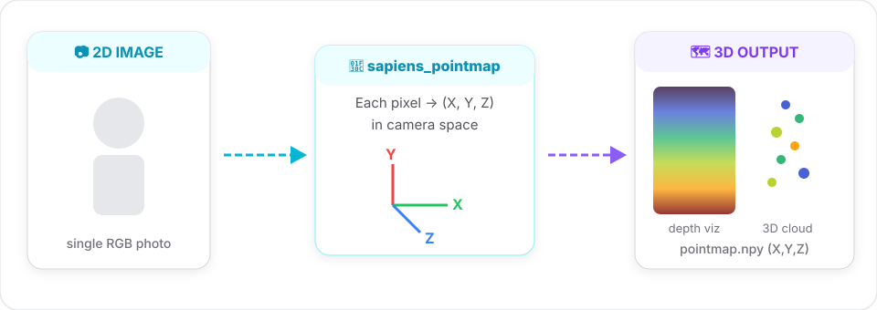

# Pointmap (3D)

Lifts each pixel to a 3D point in camera space. Think of it as "dense depth + intrinsics, but as one tensor".

!!! tip "Same input pipeline as segmentation and normals"
    All dense tasks share the same interface. Here's the input image used across all guide examples:

    <figure markdown="span">
      { width="240" loading="lazy" }
      <figcaption>Sample input image</figcaption>
    </figure>

## Signature

```python
sapiens_pointmap(
    input_path:  str,
    output_dir:  str,
    model_size:  str = "0.4b",
    device:      str = "cuda:0",
    save_pred:   bool = True,
) -> dict
```

## Example

```python
from strands_sapiens import sapiens_pointmap

sapiens_pointmap(
    input_path="person.jpg",
    output_dir="out/",
)
```

Output:

- `out/person.jpg` - side-by-side input vs. turbo-colormap of the z-channel
- `out/person_pointmap.npy` - `3×H×W` float array, channels = (X, Y, Z) in camera space

## Use it as a real 3D cloud

Install the optional `open3d` extra:

```bash
pip install 'strands-sapiens[pointmap]'
```

Then:

```python
import numpy as np
import open3d as o3d

pm = np.load("out/person_pointmap.npy")   # (3, H, W)
pts = pm.transpose(1, 2, 0).reshape(-1, 3)
pts = pts[~np.isnan(pts).any(axis=1)]

# Optional: color from the original image
import cv2
img = cv2.cvtColor(cv2.imread("person.jpg"), cv2.COLOR_BGR2RGB)
img = cv2.resize(img, pm.shape[1:][::-1])
colors = img.reshape(-1, 3) / 255.0

cloud = o3d.geometry.PointCloud()
cloud.points = o3d.utility.Vector3dVector(pts)
cloud.colors = o3d.utility.Vector3dVector(colors[:len(pts)])
o3d.visualization.draw_geometries([cloud])
```

## Why this is powerful

- **Metric human models** from a single RGB image.
- **AR placement**: anchor effects on a specific body region using seg + pointmap jointly.
- **Biometrics**: extract real height / arm span / stride from 2D photos.

## Related

- [Normals →](normals.md) · [Segmentation →](segmentation.md)
- [Pose + seg pipeline example →](../examples/pose-seg.md)

<figure markdown="span">
  { width="100%" loading="lazy" }
  <figcaption>Pointmap data flow</figcaption>
</figure>
