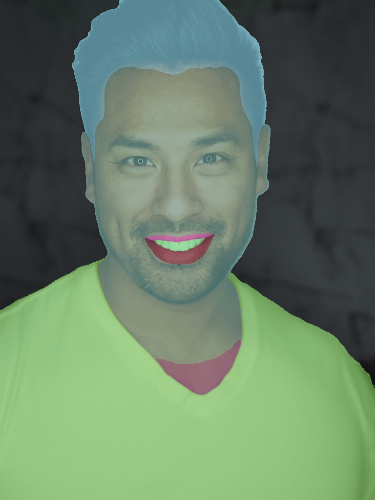
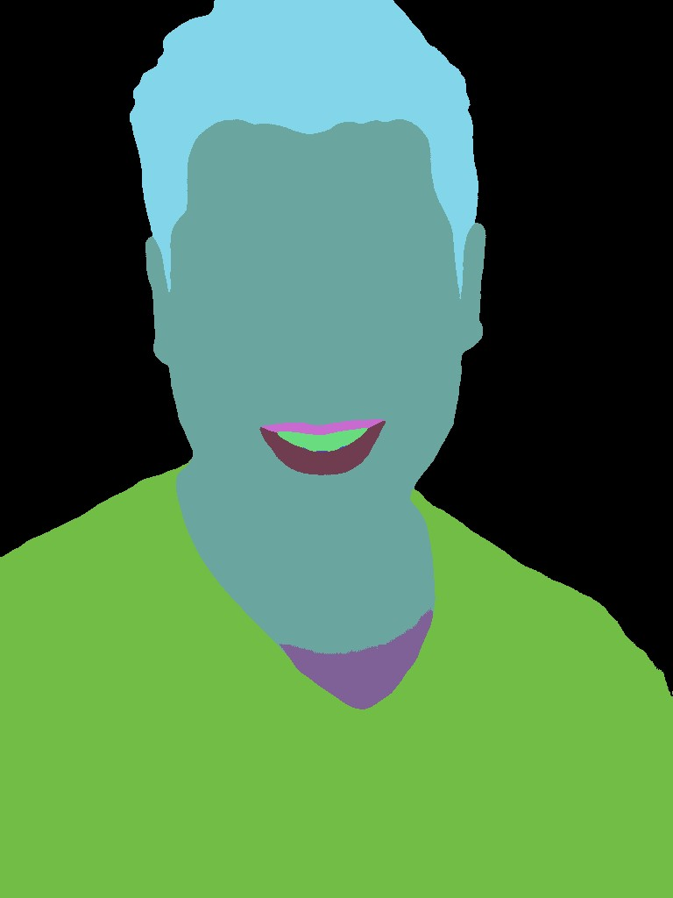
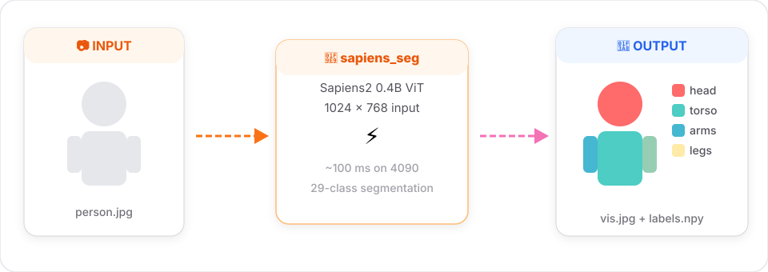

# Segmentation

29-class body-part segmentation, trained on Shutterstock Goliath.

<figure markdown="span">
  { width="480" loading="lazy" }
  <figcaption>Real <code>sapiens_seg</code> output (0.4b) — colored body-part labels blended with input</figcaption>
</figure>

## Classes

Head, face, hair, torso, upper/lower arms, hands, upper/lower legs, feet, plus finer face parts (eyes, mouth, ears, brows). See the [Sapiens2 repo](https://github.com/facebookresearch/sapiens2) for the full 29-class palette.

## Signature

```python
sapiens_seg(
    input_path:  str,          # file OR directory
    output_dir:  str,
    model_size:  str = "0.4b", # 0.4b | 0.8b | 1b | 5b
    device:      str = "cuda:0",
    save_pred:   bool = True,  # also write ._seg.npy label maps
) -> dict
```

## Minimal example

```python
from strands_sapiens import sapiens_seg

sapiens_seg(
    input_path="person.jpg",
    output_dir="out/",
    model_size="0.4b",
)
```

Output:

- `out/person.jpg` - side-by-side input vs. colored segmentation
- `out/person_seg.npy` - `H×W` `int` label map

<div class="grid" markdown>

<figure markdown="span">
  { width="240" loading="lazy" }
  <figcaption>Input</figcaption>
</figure>

<figure markdown="span">
  { width="240" loading="lazy" }
  <figcaption>29-class label map (colored)</figcaption>
</figure>

<figure markdown="span">
  { width="240" loading="lazy" }
  <figcaption>Blended overlay</figcaption>
</figure>

</div>

## Loading the raw prediction

```python
import numpy as np
labels = np.load("out/person_seg.npy")
print(labels.shape, labels.dtype, labels.min(), labels.max())
# e.g. (1024, 768) int64 0 28
```

## From an agent

```python
agent("Run body-part segmentation on ./photos and save labels + vis to ./out")
```

## Tips

- **Smallest good size**: `0.4b` gives sharp boundaries on a single 1024×768 image in ~100ms on a 4090.

<figure markdown="span">
  { width="100%" loading="lazy" }
  <figcaption>Segmentation data flow</figcaption>
</figure>

- **For print/poster use**: jump to `1b` or `5b` - the edge quality difference is visible on hands and hair.
- **Batch**: pass a directory for `input_path`. Currently processes images sequentially; batch mode is on the roadmap.

## Troubleshooting

- `Missing checkpoint: .../sapiens2_0.4b_seg.safetensors` → [Download it](../getting-started/checkpoints.md).
- `No config found for task=seg ...` → Your installed `sapiens` package version is newer than this wrapper knows about. The wrapper falls back to `rglob("sapiens2_0.4b_seg*.py")` under `sapiens/dense/configs/seg/` - if that still fails, open an issue with your `pip show sapiens` output.

## Related

- [Surface Normals →](normals.md)
- [Pose + seg pipeline example →](../examples/pose-seg.md)
